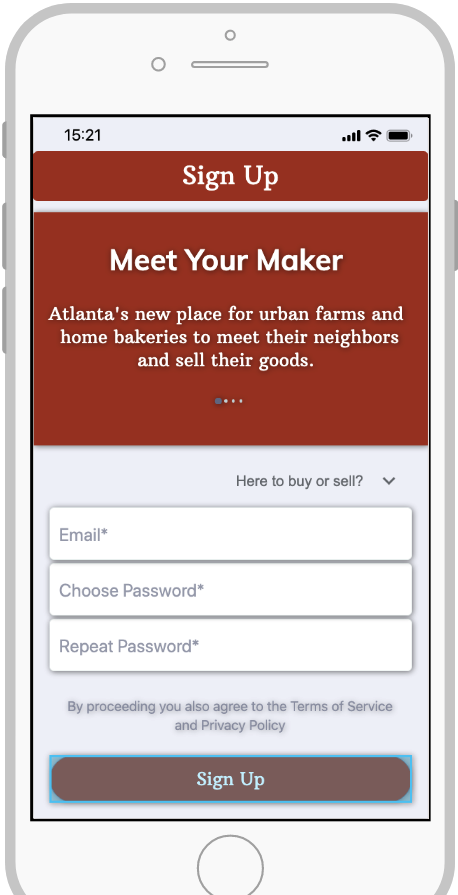
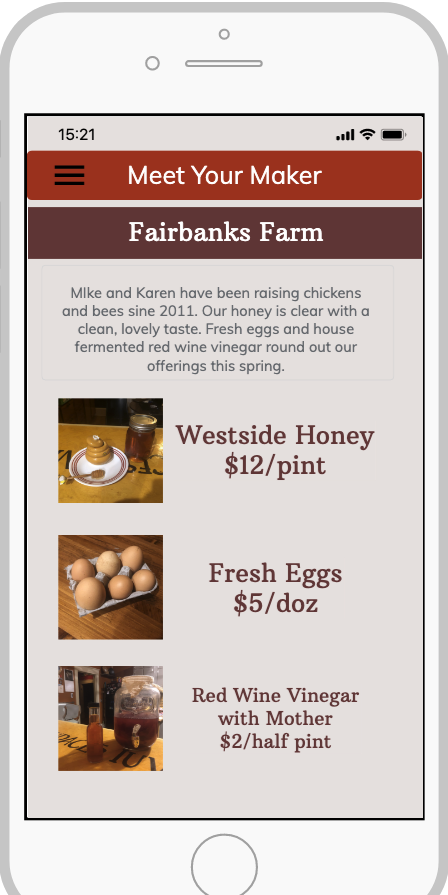

# Meet Your Maker
A wonderful market place designed by Karen, Robert, and Earl

## Get Started
---
[Link](InsertLinkHere)
 This app is created for all those individuals who would like to sell their goods in a more friendly environment. As users log into the MYM network they can choose to buy/sell/browse local goods and services. If a user wants to purchase a good, they simply add it to their cart and proceed to purchase. This will prompt the seller and they will ship the product. 
---

### Trello Board
[Link](https://trello.com/b/8J1SKHlY/workingtitle)
---

#### Screenshots

---

#### User Stories
 >Karen and Mike sell eggs and honey. They don't like facebook but it's the only way to the their neighbors know when new harvests are in. They would love an app that would allow them a little home to display their wares and respond to buyer inquiries.
 
 >Jane is laid off from her job due to Covid19. She bakes cakes and cookies and could sell them for extra money. She needs a platform to let people in her area know of her new goods and chat with her about orders. She would like to have a page of her own to show her unique style.
 
 >Megan has missed being able to sell her jewlery at local markets. Her hobby of making jewlry is an easy source of extra income, but she needs a place to sell her goods as they get lost in the bigger sites. She would like to stand out more than in a large nationwide store. 
---

###### Stretch Goals*
- [ ] Implement other areas to match makers/buyers
- [ ] Give cities/towns the ability to integrate Makers Markets/Farmers Markets to the calendar
- [ ] Have a two-way review system so Sellers would know of problem Buyers
- [ ] full mobile functionality
---

ERD

---

WireFrame
[Link](https://share.proto.io/LMSOX5/)
 

---

Technologies Used
- Javascript
- Html
- CSS
- NodeJS
- ExpressJS
- Express Generator
- MongoDB
- MongooseJS
- MongoDB Atlas
- React
- REDUX
- EJS Templating
- Fetch in JS
- Postman API Development
- JWT OAuth
- Proto.io
- Powtunes